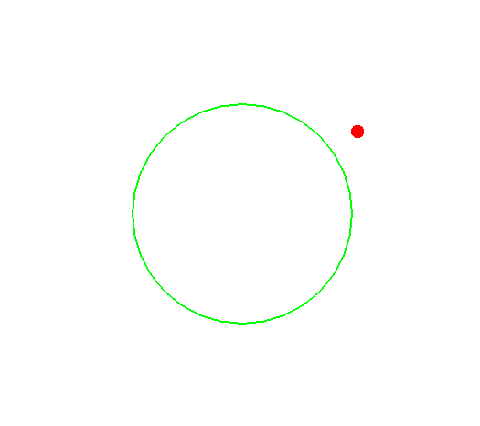
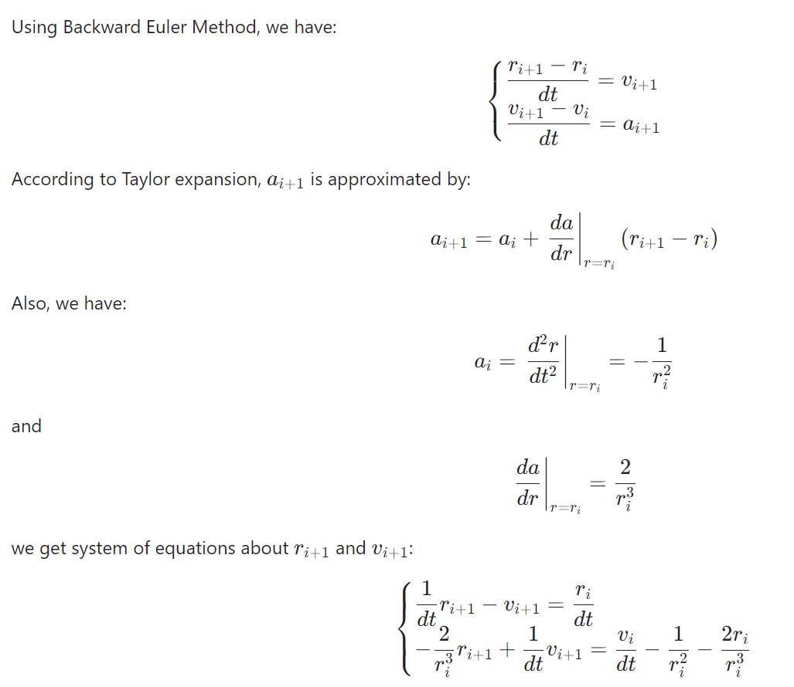

# Task01: Implicit Time Integration


## Task Description
This program solves the equation of motion $\dfrac{d^2 r}{d t^2} = -\dfrac{1}{r^2}$ and visualize it in the polar coordinate, simulating the motion of small objects under gravity. Every time the ball rebounds it loses some energy.

## Solution: Backward(Implicit) Euler Method 
**[Backward Euler Method](https://en.wikipedia.org/wiki/Backward_Euler_method)**

Suppose:
- $r_{i}$, $v_{i}$, $a_{i}$ are the radius, vertical velocity and vertical acceleration at current time step $t_{i}$  
- $r_{i+1}$, $v_{i+1}$, $a_{i+1}$ are the radius, vertical velocity and vertical acceleration at next time step $t_{i+1}$  
- $dt$ is the time interval between time steps

<br />


**Relating Code:**

line 35:
```cpp
Eigen::Vector2f time_integration_implicit(const Eigen::Vector2f& p0, float dt){ // backward Euler
  const float r0 = p0.x(); // current radius
  const float v0 = p0.y(); // current radius velocity
  const float dfdr = 2.f/(r0*r0*r0); // hint!
  float f0 = -1.0f / (r0*r0); // force
  Eigen::Matrix2f A;
  Eigen::Vector2f b;
  // modify the following two lines to implement implicit time integration
  A << 1.f/dt, -1.f, -dfdr, 1.f/dt;
  b << r0/dt, v0/dt + f0 - dfdr*r0;
  return A.inverse()*b;
}
```


