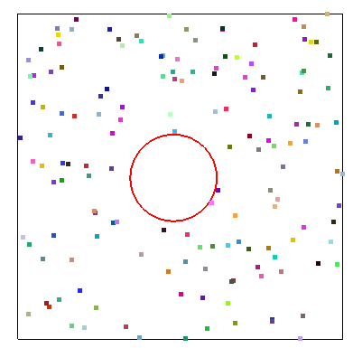

# Linear Momentum Conservation 




## Task Description
Simulate [Brownian motion](https://en.wikipedia.org/wiki/Brownian_motion). 

## Momentum Conservation
The [coefficient of restitution](https://en.wikipedia.org/wiki/Coefficient_of_restitution) is 1 and it is a perfectly elastic collision.

Suppose
- $u_{1}$ and $u_{2}$ are linear velocity before the collision along the collision line, which is known.
- $v_{1}$ and $v_{2}$ are linear velocity before the collision along the collision line.

According to energy conservation and momentum conservation we have:
$$\frac{1}{2}m_{1}u^2_{1}+\frac{1}{2}m_{2}u^2_{2}=\frac{1}{2}m_{1}v^2_{1}+\frac{1}{2}m_{2}v^2_{2}\tag{1}$$
$$m_{1}u_{1}+m_{2}u_{2}=m_{1}v_{1}+m_{2}v_{2}\tag{2}$$

With equation $(1)$ and equation $(2)$ we have:
$${u_{1}+v_{1}=v_{2}+u_{2}}\tag{3}$$

With equation $(2)$ and equation $(3)$ we have a system of linear equations, where $v_{1}$ and $v_{2}$ can be solved out.

**Relating Code**

line 58 in function ```collide_particle_ball```
```cpp
float u1 = p.velo.dot(plane_norm);
float u2 = ball_velo.dot(plane_norm);
float v1 = ((particle_mass - ball_mass)*u1 + 2*ball_mass*u2) / (particle_mass + ball_mass);
const Eigen::Vector2f impulse = (particle_mass * (u1 - v1)) * plane_norm;
p.velo += (-impulse) / particle_mass;
ball_velo += impulse / ball_mass;
```