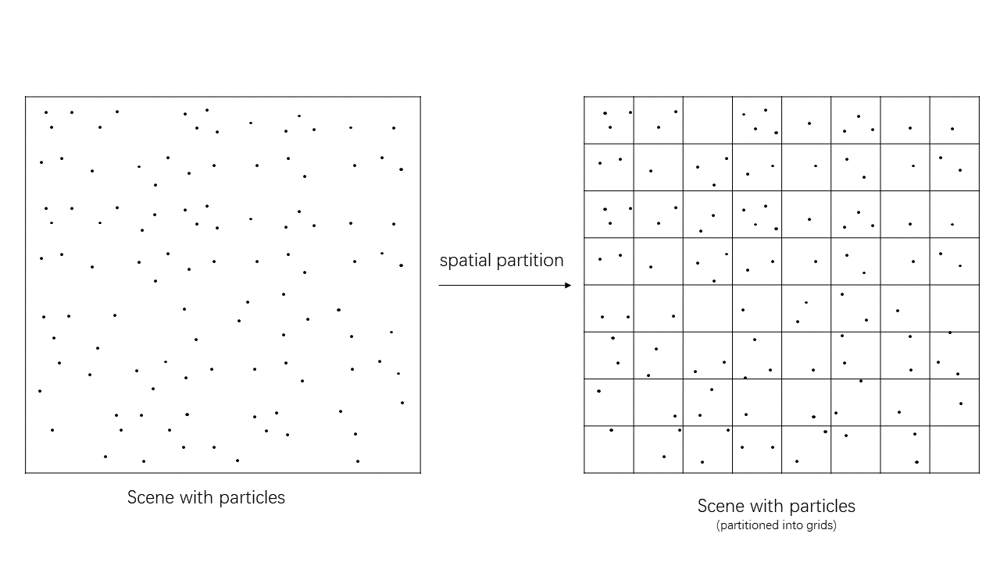
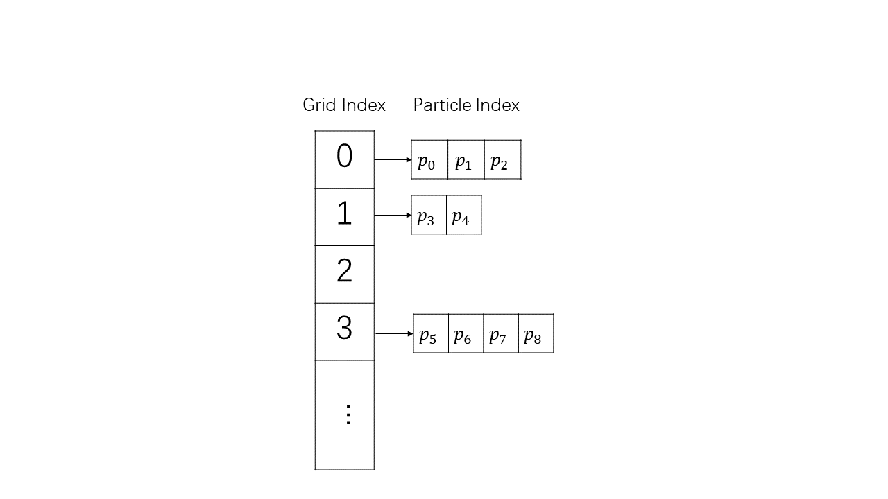
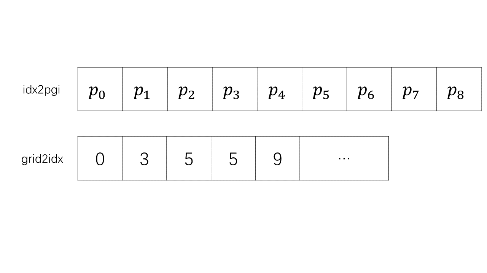

# Task03: Acceleration of N-body Simulation


## Task Description

This program computes [n-body simulation](https://en.wikipedia.org/wiki/N-body_simulation), where the particles move while attracting each others.


## Solution: Spatial Hash
First, partition the scene into $m \times m$ grids.  
  

For a given particle postion, the grid index to which it belongs can be computed by a Hash function. Sorting the particles according to their grid index resulting a data structure like this:  


This data structure is implemented by jagged array. The particle indexes are stored in a linear list ```idx2pgi```. Given the grid index $i$, all the particles in the grid can be indexed in ```idx2pgi``` using indexes between ```grid2idx[i]``` to ```grid2idx[i+1]```



**Relating Code**
line 123
```cpp
void set_force_accelerated(
    ...
```