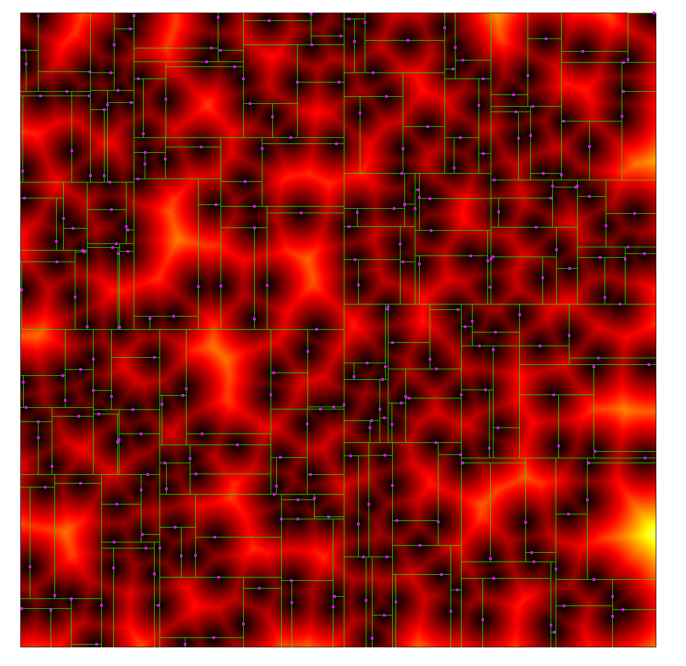

# Task04: Accelerated Nearest Search using Kd-Tree




## Task Description

Compute the **distance map** from the particles.  
Each pixel represents the distance to its nearest particle.


## Solution: K-d Tree and Nearest Neighbour Search
[Kd-tree data structure](https://en.wikipedia.org/wiki/K-d_tree)

Following wikipedia's algorithm description:
```
The nearest neighbour search (NN) algorithm aims to find the point in the tree that is nearest to a given input point. This search can be done efficiently by using the tree properties to quickly eliminate large portions of the search space.

Searching for a nearest neighbour in a k-d tree proceeds as follows:

1.Starting with the root node, the algorithm moves down the tree recursively, in the same way that it would if the search point were being inserted (i.e. it goes left or right depending on whether the point is lesser than or greater than the current node in the split dimension).

2.Once the algorithm reaches a leaf node, it checks the node point and if the distance is better than the "current best", that node point is saved as the "current best".

3.The algorithm unwinds the recursion of the tree, performing the following steps at each node:

(1)If the current node is closer than the current best, then it becomes the current best.

(2)The algorithm checks whether there could be any points on the other side of the splitting plane that are closer to the search point than the current best. In concept, this is done by intersecting the splitting hyperplane with a hypersphere around the search point that has a radius equal to the current nearest distance. Since the hyperplanes are all axis-aligned this is implemented as a simple comparison to see whether the distance between the splitting coordinate of the search point and current node is lesser than the distance (overall coordinates) from the search point to the current best.

- If the hypersphere crosses the plane, there could be nearer points on the other side of the plane, so the algorithm must move down the other branch of the tree from the current node looking for closer points, following the same recursive process as the entire search.

- If the hypersphere doesn't intersect the splitting plane, then the algorithm continues walking up the tree, and the entire branch on the other side of that node is eliminated.

4. When the algorithm finishes this process for the root node, then the search is complete.
```

**original repository's code**
```cpp
void nearest_kdtree(
    Eigen::Vector2f &pos_near,
    const Eigen::Vector2f &pos_in,
    const std::vector<Node> &nodes,
    unsigned int idx_node,
    float x_min, float x_max,
    float y_min, float y_max,
    int i_depth) {
  if (idx_node >= nodes.size()) { return; } // this node does not exist

  if ((pos_near - pos_in).norm() < signed_distance_aabb(pos_in, x_min, x_max, y_min, y_max))) return;

  const Eigen::Vector2f pos = nodes[idx_node].pos;
  if ((pos - pos_in).norm() < (pos_near - pos_in).norm()) { pos_near = pos; } // update the nearest position

  if (i_depth % 2 == 0) { // division in x direction
    nearest_kdtree(pos_near, pos_in, nodes, nodes[idx_node].idx_node_left, x_min, pos.x(), y_min, y_max, i_depth + 1);
    nearest_kdtree(pos_near, pos_in, nodes, nodes[idx_node].idx_node_right, pos.x(), x_max, y_min, y_max, i_depth + 1);
  } else { // division in y-direction
    nearest_kdtree(pos_near, pos_in, nodes, nodes[idx_node].idx_node_left, x_min, x_max, y_min, pos.y(), i_depth + 1);
    nearest_kdtree(pos_near, pos_in, nodes, nodes[idx_node].idx_node_right, x_min, x_max, pos.y(), y_max, i_depth + 1);
  }
}
```

  
**wikipedia's algorithm implementation** (much faster than the original one)
```cpp
void nearest_kdtree(
    Eigen::Vector2f &pos_near,
    const Eigen::Vector2f &pos_in,
    const std::vector<Node> &nodes,
    unsigned int idx_node,
    float x_min, float x_max,
    float y_min, float y_max,
    int i_depth) {
  if (idx_node >= nodes.size()) { return; } // this node does not exist

  const Eigen::Vector2f pos = nodes[idx_node].pos;

  if (i_depth % 2 == 0) { // division in x direction
      if (pos_in.x() < pos.x())
      {
          nearest_kdtree(pos_near, pos_in, nodes, nodes[idx_node].idx_node_left, x_min, pos.x(), y_min, y_max, i_depth + 1); // go down to leave node first
          if ((pos - pos_in).norm() < (pos_near - pos_in).norm()) { pos_near = pos; } // update the nearest position
          if ((pos_near - pos_in).norm() >= signed_distance_aabb(pos_in, pos.x(), x_max, y_min, y_max)) // if hyperplane intersects hypersphere, go to the other branch
          {
              nearest_kdtree(pos_near, pos_in, nodes, nodes[idx_node].idx_node_right, pos.x(), x_max, y_min, y_max, i_depth + 1);
          }
      }
      else
      {
          nearest_kdtree(pos_near, pos_in, nodes, nodes[idx_node].idx_node_right, pos.x(), x_max, y_min, y_max, i_depth + 1);
          if ((pos - pos_in).norm() < (pos_near - pos_in).norm()) { pos_near = pos; }
          if ((pos_near - pos_in).norm() >= signed_distance_aabb(pos_in, x_min, pos.x(), y_min, y_max))
          {
              nearest_kdtree(pos_near, pos_in, nodes, nodes[idx_node].idx_node_left, x_min, pos.x(), y_min, y_max, i_depth + 1);
          }
      }
  }
  else { // division in y-direction
      if (pos_in.y() < pos.y())
      {
          nearest_kdtree(pos_near, pos_in, nodes, nodes[idx_node].idx_node_left, x_min, x_max, y_min, pos.y(), i_depth + 1);
          if ((pos - pos_in).norm() < (pos_near - pos_in).norm()) { pos_near = pos; }
          if ((pos_near - pos_in).norm() >= signed_distance_aabb(pos_in, x_min, x_max, pos.y(), y_max))
          {
              nearest_kdtree(pos_near, pos_in, nodes, nodes[idx_node].idx_node_right, x_min, x_max, pos.y(), y_max, i_depth + 1);
          }
      }
      else
      {
          nearest_kdtree(pos_near, pos_in, nodes, nodes[idx_node].idx_node_right, x_min, x_max, pos.y(), y_max, i_depth + 1);
          if ((pos - pos_in).norm() < (pos_near - pos_in).norm()) { pos_near = pos; }
          if ((pos_near - pos_in).norm() >= signed_distance_aabb(pos_in, x_min, x_max, y_min, pos.y()))
          {
              nearest_kdtree(pos_near, pos_in, nodes, nodes[idx_node].idx_node_left, x_min, x_max, y_min, pos.y(), i_depth + 1);
          }
      }
  }
  
}
```